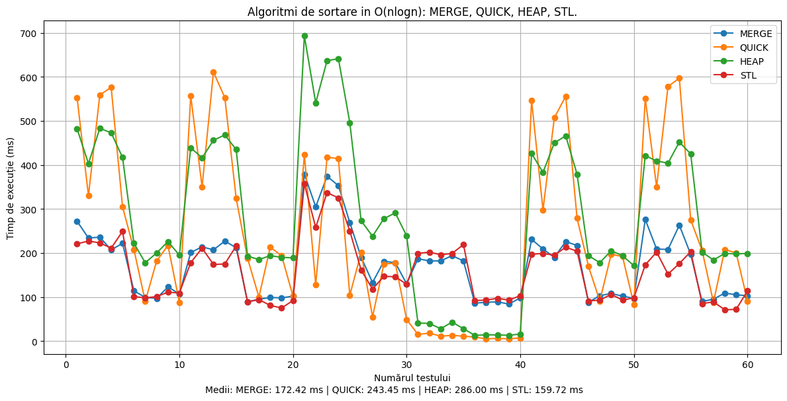
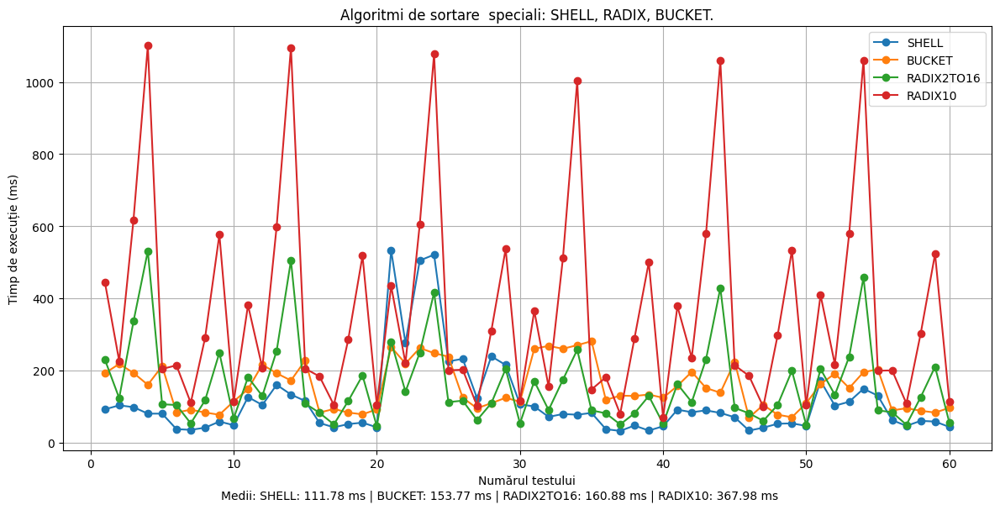

# SortingAlgorithmTester


##  How It Works

1. **Test Generation**  
   `main.py` generates random input test files inside the `generated_files` directory (The number of numbers can be ajusted as needed).

2. **Sorting Execution**  
   `tester_script.ps1` runs `sort_algorithm_tester.cpp`, which benchmarks multiple sorting algorithms using the generated test files.  
   The results (execution times) are saved in `log.txt`.

3. **Graph Generation**  
   `grafic.py` reads the results from `log.txt` and generates two graphs:
   - One for algorithms with average time complexity **O(n log n)**
   - One for more "special" or atypical algorithms  

 


##  How to Run

1. Make sure you have **Python 3.x**, **C++ compiler**, and **PowerShell** installed.
2. Install Python dependencies:
   ```bash
   pip install matplotlib
3. Run these commands in order.
 ```
   python3 main.py
   ./tester_script.ps1
   python3 grafic.py
```
## Output Examples

- `nlogn.png`
 
- `speciali.png`
- 


